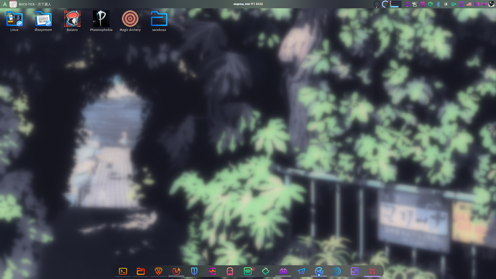
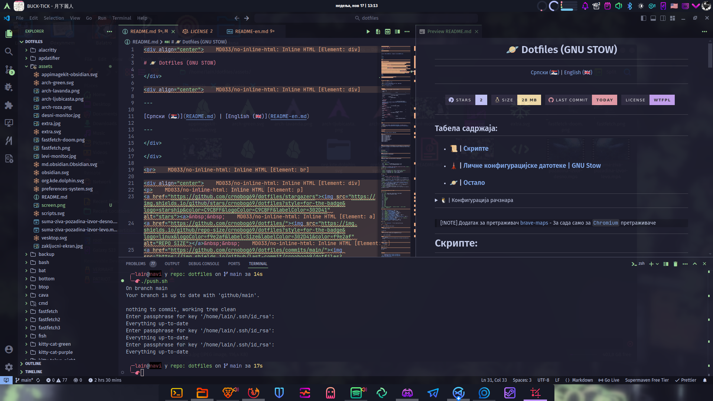
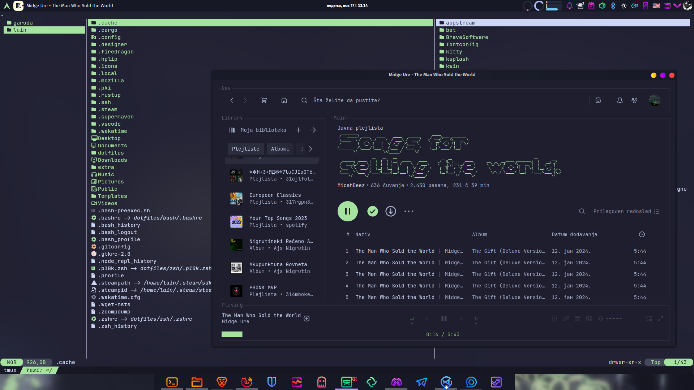

<div align="center">

# 🪐 | Dotfiles (GNU STOW)

</div>

<div align="center">

---

[Српски (🇷🇸)](README.md) | [English (🇬🇧)](README-en.md)

---

</div>

</div>

<br>

<div align="center">
<p>
<a href="https://github.com/crnobog69/dotfiles/stargazers"><a>&nbsp;&nbsp;
<a href="https://github.com/crnobog69/dotfiles/"></a>&nbsp;&nbsp;
<a href="https://github.com/crnobog69/dotfiles/commits/main/"></a>&nbsp;&nbsp;
<a href="https://github.com/crnobog69/dotfiles/LICENSE"></a>&nbsp;&nbsp;
</p>
</div>

<br/><br/>
<br/><br/>
<br/><br/>
<br/><br/>

---

## Табела садржаја:

- ### 📜 | [Скрипте](#скрипте)

- ### 🗼 | [Личне конфигурацијске датотеке](#личне-конфигурацијске-датотеке)

- ### 🪐 | [Остало](#остало)

---

<details>
  <summary>🐧 | Конфигурација рачзнара</summary>
  
  | Категорија           | Детаљи                                                                                                        | Друго                     |
  | -------------------- | ------------------------------------------------------------------------------------------------------------- | ------------------------- |
  | **ОС**               | Arch Linux (Garuda Linux)                                                                                     | Windows 11                |
  | **РО**               | KDE Plasma 6.2                                                                                                | -                         |
  | **Иконице**          | BeautyLine                                                                                                    | Прилагођене Papirus-Dark - [Catppuccin Latte Lavender Folders](https://github.com/catppuccin/papirus-folders)|
  | **Композитор**       | Wayland                                                                                                       | -                         |
  | **Шкољка**           | zsh (Starship, Zoxide, Zinit, Tmux)                                                                                 | fish, bash                |
  | **Промт**            | Starship                                                                                                      | -                         |
  | **Терминал**         | Kitty                                                                                                         | Alacritty, Konsole        |
  | **ИРО**              | VS Codium, VS Code, micro                                                                                     | Zed                       |
  | **Менаџер датотека** | Dolphin                                                                                                       | Thunar                    |
  | **Прегледач**        | Brave                                                                                                         | Firefox Developer Edition |

</details>

---

<br>

> [!NOTE]
> Додатак за претраживач [brave-maps](brave-maps) - За сада само за [`Chromium`](https://alternativeto.net/category/browsers/chromium-based/) претраживаче

---

# Скрипте:

### Linux

Прво морате да дате дозволу скрипти/ама:

```
cd dotfiles
chmod +x scripts/pkg-rs.sh
chmod +x scripts/pkg-en.sh
chmod +x scripts/kolo.sh
chmod +x scripts/ftn.sh
chmod +x scripts/crc.sh
chmod +x scripts/entropy.sh
chmod +x scripts/zap.sh
chmod +x scripts/catbox.sh
chmod +x scripts/litterbox.sh
chmod +x push.sh
chmod +x pull.sh
```

/

```
cd dotfiles && chmod +x scripts/pkg-rs.sh scripts/pkg-en.sh scripts/kolo.sh scripts/ftn.sh scripts/crc.sh scripts/entropy.sh scripts/zap.sh push.sh pull.sh

```

### Windows

#### Power Shell

```
Set-ExecutionPolicy RemoteSigned
```

#### CMD (Админинстратор)

```
powershell -Command "Set-ExecutionPolicy RemoteSigned"
```

### 📦 | Пакети

У [`scripts`](scripts).

- 🇷🇸 | `pkg.sh` - листа пакета/програма које користим
- 🇬🇧 | `pkg-en-sh` - list of packages/programs I use

> [!NOTE]
> Разлика је само у језику. За прилагођавање изменити датотетку [`scripts/packages.json`](scripts/packages.json).

### 🔄 | Git

- `push.sh` - прилагођена `pull`/`push` скрипта за моје `dotfiles`
- `pull.sh` - прилагођена `pull` скрипта за моје `dotfiles`
- `push.ps1` - прилагођена `pull`/`push` скрипта (Windows)
- `pull.ps1` - прилагођена `pull` скрипта (Windows)

### 🐧 | Остало

> [!NOTE]  
> `ftn` - означава **_Факултет Техничких Наука_**.

- `ftn.sh` - прилагођена скрипта која приказује да ли је недеља парна или непарна
- `ftn.ps1` - прилагођена скрипта која приказује да ли је недеља парна или непарна (Windows)
- [`vhs.sh`](scripts/vhs/README.md) - Скрипта за обраду видеа (у `scripts/vhs`)
- `pasters` - скрипта која користи API од [paste.rs](https://paste.rs/)
- [`kolo`](https://github.com/crnobog69/kolo) - Скрипта за претрагу Arch Linux репозиторијума (укључујући AUR)
- `crc.sh` - прилагођена скирпта за компајлирање програма написаних у `C` програмском језику уз помоћ `gcc`
- `entropy.sh` - прилагођена скрипта за чишћење система
- `zap.sh` - прилагођена скрипта за ажурирање система са подршком за више операцисних система
- `catbox.sh` - прилагођена скрипта за коришћење [catbox.moe](https://catbox.moe/)
- `litterbox.sh` - прилагођена скрипта за коришћење [litterbox.catbox.moe](https://litterbox.catbox.moe/)
- `install-wakapi.sh` - персонализован инсталациона скрипта за [wakapi](https://github.com/flyingrub/wakapi) за лочно хостовање
- `desktopify.sh` - персонализована скрипта за креирање `.desktop` датотеке за AppImage апликације
- `cgit.sh` - персонализована скрипта за `git`

---

## Личне конфигурацијске датотеке:

### `GNU Stow`

- 😺 | `kitty` (Mocha Green, Mocha Purple, Tokyo Night)
- 🖋️ | `micro` (Mocha Transparent, Mocha)
- ⚡ | `zed`
- 🐚 | `zsh`
- 🐚 | `bash`
- 🐟 | `fish`
- 🖼️ | `fastfetch`
- 🌴 | `alacritty`
- 🚀 | `starship`
- 🥺 | `bottom`
- 📢 | `cava`
- 🦇️ | `bat`
- 🏆 | `btop`
- 🏖️ | `rio`
- 🦆 | `yazi`
- 🌈 | `lsd`
- 🎥 | `mpv`
- ⚙️ | `nvim`
- 💽 | `tmux`
- 🐧 | `transparency.toggle`, `plasmusic-toolbar`, `zayron.simple.separator`, `apdatifier`

### Ручно:

- Посетите [`crnobog69/extra`](https://github.com/crnobog69/extra)

- 🧰 | [`assets`](assets/) - слике и иконице и остало

### Остало

- 📰 | [`cmd`](cmd/cmd.md) - Основне команде за Arch Linux и прилагођене команде

## 🛠️ Постављање

> [!NOTE]
> За постављане `Tmux` потребно је испратити: [`tmux-plugins/tpm`](https://github.com/tmux-plugins/tpm), [`tmuxplugins/tmux-cpu`](https://github.com/tmux-plugins/tmux-cpu) и (опционално) [`catppuccin/tmux`](https://github.com/catppuccin/tmux).

1. Преузмите GNU Stow (Arch Linux):

   ```
   sudo pacman -S stow
   ```

2. Клонирање:

   ```
   git clone https://github.com/crnobog69/dotfiles.git
   ```

   /

   ```
   git clone https://codeberg.org/crnobog/dotfiles.git && git clone https://github.com/crnobog69/extra.git
   ```

3. Примена конфигурација:

   ```
   cd ~/.dotfiles
   stow kitty-cat-green zed zsh fastfetch micro starship fish bottom cava bat mpv
   ```

   или (једно)

   ```
   cd ~/.dofiles
   stow zed
   ```

### 🔄 Ажурирање

```
cd ~/.dotfiles
git pull
```

---

## Остало

- 😺 | [Catppuccin](https://github.com/catppuccin)
- 🗼 | [Tokyo Night](https://github.com/tokyo-night)
- 🗺️ | [Brave Maps](https://github.com/stignarnia/add-maps-links-brave-search)
- 🐇 | [MangaDex](https://github.com/crnobog69/mangadex)
- 🐈 | [Miruro](https://github.com/crnobog69/miruro-catppuccin)
- 🎵 | [Spicetify](https://github.com/spicetify/cli)
- ⚛️ | [Cobaltium](https://github.com/crnobog69/cobaltium)
- 📝 | [Notesnook](https://github.com/crnobog69/notesnook)
- 🦀 | [pasters](https://github.com/crnobog69/pasters-terminal)
- 📻 | [kolo](https://github.com/crnobog69/kolo)
- 🐒 | [Violentmonkey](https://github.com/crnobog69/violentmonkey-mocha)
- 🦊 | [Crnobog - Творац/Ја](https://github.com/crnobog69)

<br>

#### Репозиторијуми (Dotfiles):

🐙 | [`Github | Репозиторијум`](https://github.com/crnobog69/dotfiles)

🏔️ | [`Codeberg | Репозиторијум`](https://codeberg.org/crnobog/dotfiles)

🦊 | [`GitLab | Репозиторијум`](https://gitlab.com/crnobog/dotfiles)

<br>

#### Репозиторијуми (Extra):

🐙 | [`Github | Репозиторијум`](https://github.com/crnobog69/extra)

🏔️ | [`Codeberg | Репозиторијум`](https://codeberg.org/crnobog/extra)

🦊 | [`GitLab | Репозиторијум`](https://gitlab.com/crnobog/extra)

<br>

#### Репозиторијуми (dotwin | Windows):

🐙 | [`Github | Репозиторијум`](https://github.com/crnobog69/dotwin)

🏔️ | [`Codeberg | Репозиторијум`](https://codeberg.org/crnobog/dotwin)

🦊 | [`GitLab | Репозиторијум`](https://gitlab.com/crnobog/dotwin)

<br>

---
